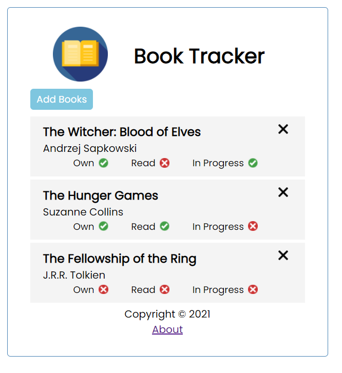

# BookTracker

A project created by me based off the Angular tutorial by TraversyMedia on YouTube. My own take on the Task-Tracker web-application designed in the video to learn and experiement with the Angular framework. This project, however, uses book objects instead of tasks with the idea of tracking the books in someone's possession.

This project was generated with [Angular CLI](https://github.com/angular/angular-cli) version 13.1.2.
